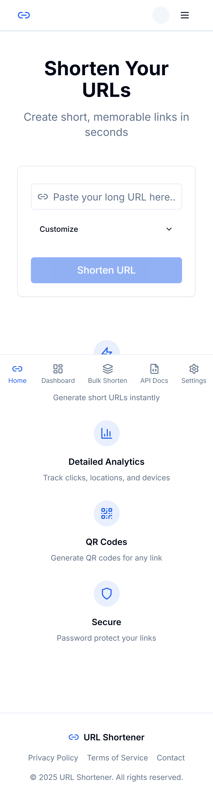
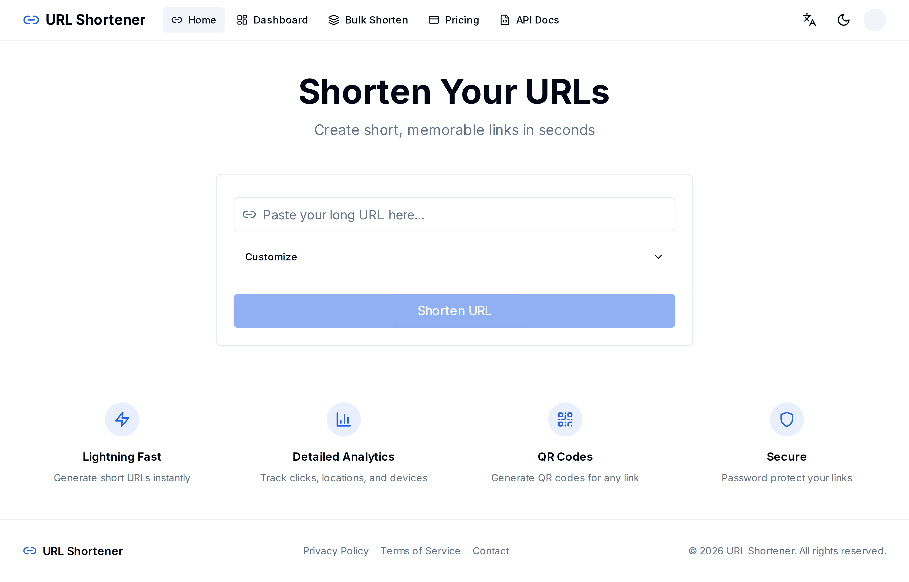
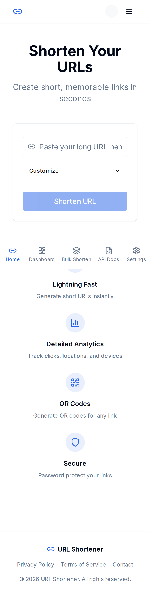
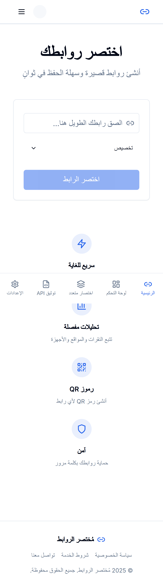
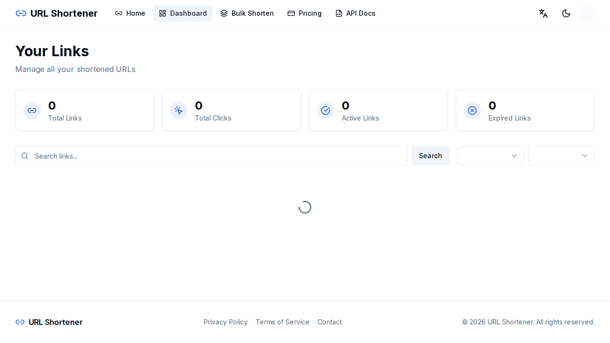
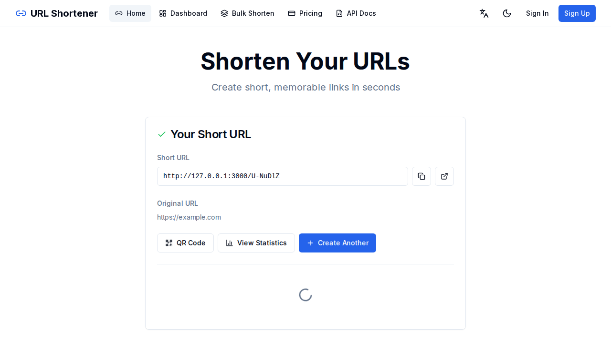

# URL Shortener

A production-ready, enterprise-grade URL shortener built with Next.js 14, TypeScript, and PostgreSQL. The first fully Arabic-supported URL shortener with complete RTL support.



## Features

### Core Features
- **URL Shortening** - Generate short, memorable URLs with nanoid (7 chars)
- **Custom Aliases** - Create your own branded short links (3-50 chars)
- **QR Code Generation** - Generate customizable QR codes with colors and sizes
- **Click Analytics** - Track clicks, locations, devices, browsers, OS, and referrers
- **Link Expiration** - Set expiry dates for temporary links
- **Password Protection** - Secure your links with bcrypt-hashed passwords
- **Bulk Shortening** - Shorten up to 100 URLs at once
- **Link Preview** - Preview destination before redirecting

### Advanced Features
- **A/B Testing** - Test multiple destination URLs with traffic splitting
- **Device/Geo/Browser Targeting** - Route users based on device, location, or browser
- **Link Cloaking** - Hide destination URLs (iframe, JS redirect, meta refresh)
- **Mobile Deep Linking** - App store fallbacks for iOS/Android
- **UTM Parameter Builder** - Built-in campaign tracking
- **Bio Pages** - Link-in-bio pages with customizable themes
- **Retargeting Pixels** - Facebook, Google Analytics, TikTok pixel support

### Team & Enterprise
- **Multi-tenant Workspaces** - Create team workspaces with shared links
- **Role-based Permissions** - Owner, Admin, Member, Viewer roles
- **Team Invitations** - Invite members via email
- **Custom Domains** - Use your own domain with SSL verification

### Integrations
- **Stripe Subscriptions** - 5 plan tiers (Free, Starter, Pro, Business, Enterprise)
- **Zapier Integration** - Triggers and actions for automation
- **Webhooks** - HMAC-signed event notifications
- **Firebase FCM** - Push notifications support
- **Browser Extension** - Chrome/Firefox extension support
- **REST API** - Comprehensive API with OpenAPI 3.1 documentation

### Localization & Design
- **Bilingual Support** - English and Arabic with full RTL support
- **Dark/Light Mode** - Theme toggle with persistence
- **Responsive Design** - Mobile-first, works on all devices

## Screenshots

### Desktop View


### Mobile View


### Arabic RTL Support


### Dashboard


### QR Code Generation


## Tech Stack

| Category | Technology |
|----------|------------|
| **Framework** | Next.js 14 (App Router) |
| **Language** | TypeScript (strict mode) |
| **Styling** | Tailwind CSS |
| **Components** | shadcn/ui |
| **Database** | PostgreSQL + Prisma ORM |
| **Authentication** | NextAuth.js v5 (Google, GitHub, Credentials) |
| **Payments** | Stripe |
| **Push Notifications** | Firebase FCM |
| **Rate Limiting** | Redis (with in-memory fallback) |
| **Internationalization** | next-intl |
| **Validation** | Zod |
| **Testing** | Vitest + Playwright |
| **CI/CD** | GitHub Actions |
| **Containerization** | Docker |

## Quick Start

### Prerequisites

- Node.js 18+
- PostgreSQL 15+
- npm or yarn

### Installation

1. Clone the repository:
```bash
git clone https://github.com/mahmoodhamdi/URL-Shortener.git
cd URL-Shortener
```

2. Install dependencies:
```bash
npm install
```

3. Set up environment variables:
```bash
cp .env.example .env
# Edit .env with your configuration
```

4. Set up the database:
```bash
npx prisma generate
npx prisma db push
```

5. Start the development server:
```bash
npm run dev
```

6. Open [http://localhost:3000](http://localhost:3000)

## Using Docker

### Development
```bash
docker-compose -f docker/docker-compose.yml up
```

### Production
```bash
docker pull mwmsoftware/url-shortener:latest
docker-compose -f docker/docker-compose.prod.yml up -d
```

## Testing

```bash
# Unit tests (890 tests)
npm run test:unit

# Integration tests (295 tests)
npm run test:integration

# E2E tests (16 test files)
npm run test:e2e

# Coverage report
npm run test:coverage
```

## Environment Variables

### Required
| Variable | Description |
|----------|-------------|
| `DATABASE_URL` | PostgreSQL connection string |
| `AUTH_SECRET` | NextAuth.js secret (32+ chars) |

### Optional - OAuth
| Variable | Description |
|----------|-------------|
| `GOOGLE_CLIENT_ID` | Google OAuth Client ID |
| `GOOGLE_CLIENT_SECRET` | Google OAuth Client Secret |
| `GITHUB_CLIENT_ID` | GitHub OAuth Client ID |
| `GITHUB_CLIENT_SECRET` | GitHub OAuth Client Secret |

### Optional - Stripe
| Variable | Description |
|----------|-------------|
| `STRIPE_SECRET_KEY` | Stripe Secret API Key |
| `STRIPE_WEBHOOK_SECRET` | Stripe Webhook Signing Secret |
| `NEXT_PUBLIC_STRIPE_PUBLISHABLE_KEY` | Stripe Publishable Key |

### Optional - Firebase
| Variable | Description |
|----------|-------------|
| `FIREBASE_PROJECT_ID` | Firebase Project ID |
| `FIREBASE_CLIENT_EMAIL` | Firebase Admin SDK Email |
| `FIREBASE_PRIVATE_KEY` | Firebase Admin SDK Private Key |
| `NEXT_PUBLIC_FIREBASE_*` | Client-side Firebase config |

### Optional - Redis
| Variable | Description |
|----------|-------------|
| `REDIS_URL` | Redis connection URL |

See [CREDENTIALS.md](CREDENTIALS.md) for detailed setup instructions.

## API Documentation

Full OpenAPI 3.1 documentation available at `/api/docs`.

### Core Endpoints

#### Create Short URL
```http
POST /api/shorten
Content-Type: application/json

{
  "url": "https://example.com/very-long-url",
  "customAlias": "my-link",
  "password": "secret",
  "expiresAt": "2025-12-31T23:59:59Z"
}
```

#### Bulk Shorten
```http
POST /api/shorten/bulk
Content-Type: application/json

{
  "urls": ["https://example1.com", "https://example2.com"]
}
```

#### Get Link Statistics
```http
GET /api/links/{id}/stats?period=30d
```

### Advanced Endpoints
- `/api/links/[id]/targets` - Link targeting rules
- `/api/links/[id]/ab-test` - A/B test configuration
- `/api/links/[id]/pixels` - Retargeting pixel assignment
- `/api/workspaces/` - Workspace CRUD, members, invitations
- `/api/webhooks/` - Webhook CRUD, logs, testing
- `/api/bio/` - Bio page management
- `/api/zapier/` - Zapier triggers and actions
- `/api/extension/` - Browser extension endpoints

## Project Structure

```
url-shortener/
├── src/
│   ├── app/
│   │   ├── [locale]/           # Localized pages (en, ar)
│   │   └── api/                # REST API routes
│   ├── components/
│   │   ├── ui/                 # shadcn components
│   │   ├── url/                # URL-related components
│   │   ├── stats/              # Statistics components
│   │   └── layout/             # Layout components
│   ├── lib/
│   │   ├── url/                # URL shortening, validation, QR
│   │   ├── auth/               # NextAuth.js configuration
│   │   ├── analytics/          # Click tracking
│   │   ├── stripe/             # Payment processing
│   │   ├── workspace/          # Team workspaces
│   │   ├── webhooks/           # Webhook management
│   │   ├── targeting/          # Device/geo targeting
│   │   ├── ab-testing/         # A/B test logic
│   │   ├── bio-page/           # Bio page management
│   │   ├── cloaking/           # Link cloaking
│   │   ├── deeplink/           # Mobile deep linking
│   │   ├── retargeting/        # Pixel management
│   │   ├── zapier/             # Zapier integration
│   │   ├── extension/          # Browser extension
│   │   ├── domains/            # Custom domains
│   │   ├── rate-limit/         # Rate limiting
│   │   └── security/           # SSRF protection
│   ├── messages/               # i18n translations
│   └── types/                  # TypeScript types
├── prisma/                     # Database schema
├── __tests__/                  # Test files
│   ├── unit/                   # Unit tests
│   ├── integration/            # Integration tests
│   └── e2e/                    # E2E tests
├── docker/                     # Docker configuration
└── .github/                    # GitHub Actions
```

## Subscription Plans

| Plan | Price | Links/Month | Features |
|------|-------|-------------|----------|
| **Free** | $0 | 100 | Basic analytics, QR codes, custom alias |
| **Starter** | $5/mo | 1,000 | Advanced analytics, API access |
| **Pro** | $12/mo | 5,000 | Custom domain, no ads |
| **Business** | $25/mo | Unlimited | Team members (10), priority support |
| **Enterprise** | $50/mo | Unlimited | White label, SLA 99.9% |

## Contributing

1. Fork the repository
2. Create your feature branch (`git checkout -b feature/amazing-feature`)
3. Write tests for your changes
4. Make sure all tests pass (`npm run test`)
5. Commit your changes (`git commit -m 'Add amazing feature'`)
6. Push to the branch (`git push origin feature/amazing-feature`)
7. Open a Pull Request

## Documentation

- [CREDENTIALS.md](CREDENTIALS.md) - Environment setup guide
- [CODE_REVIEW_REPORT.md](CODE_REVIEW_REPORT.md) - Code quality report
- [COMPETITOR_ANALYSIS.md](COMPETITOR_ANALYSIS.md) - Market analysis
- [BUSINESS_PLAN.md](BUSINESS_PLAN.md) - Business model

## License

This project is licensed under the MIT License.

## Author

**Mahmood Hamdi**
- GitHub: [@mahmoodhamdi](https://github.com/mahmoodhamdi)
- Email: hmdy7486@gmail.com

---

Built with Next.js 14 | [v1.0.0](https://github.com/mahmoodhamdi/URL-Shortener/releases/tag/v1.0.0)
